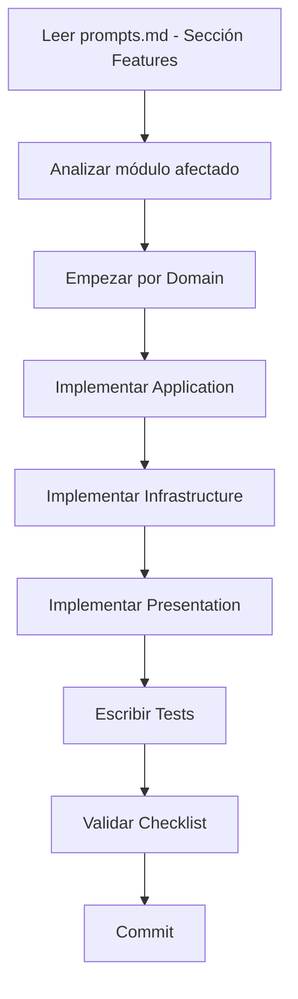
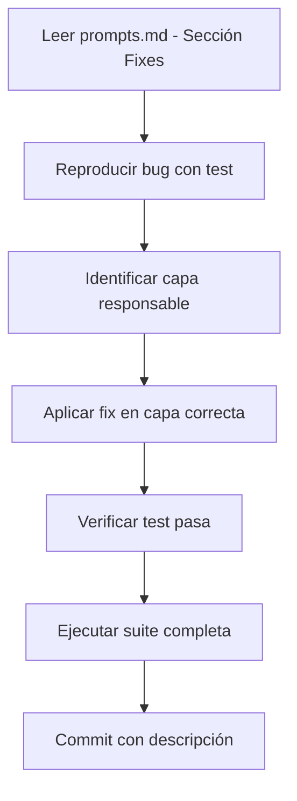
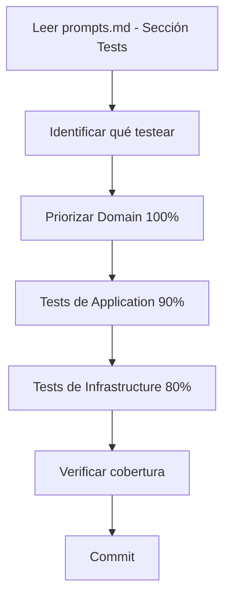

# Grace Hub Service - Índice de Documentación

> **Navegación rápida a toda la documentación del proyecto**

---

## 📚 Para Empezar

### Nuevo en el Proyecto

1. **Lee primero**: [README.md](../README.md) - Visión general
2. **Instala**: [guides/DEVELOPMENT_GUIDE.md](guides/DEVELOPMENT_GUIDE.md) - Setup inicial
3. **Entiende**: [architecture/CLEAN_ARCHITECTURE.md](architecture/CLEAN_ARCHITECTURE.md) - Arquitectura

### Desarrollador Experimentado

Ir directo a:
- [prompts/prompts.md](prompts/prompts.md) - Para trabajar con IA
- [architecture/ARCHITECTURE_RULES.md](architecture/ARCHITECTURE_RULES.md) - Reglas de referencia rápida

---

## 🗂️ Documentación por Categoría

### 🏗️ Arquitectura

| Documento | Descripción | Para quién |
|-----------|-------------|------------|
| [CLEAN_ARCHITECTURE.md](architecture/CLEAN_ARCHITECTURE.md) | Guía completa de Clean Architecture implementada | Todos |
| [ARCHITECTURE_RULES.md](architecture/ARCHITECTURE_RULES.md) | Reglas y restricciones por capa | Desarrolladores |

**Cuándo leer**:
- ✅ Antes de crear tu primera feature
- ✅ Cuando tengas dudas sobre dónde poner código
- ✅ Antes de hacer code review

---

### 🤖 Prompts para IA

| Documento | Descripción | Para quién |
|-----------|-------------|------------|
| [prompts.md](prompts/prompts.md) | Prompts completos para Claude, GPT-4, etc. | IAs y Devs |

**Contiene**:
1. Prompt para crear features
2. Prompt para corregir bugs
3. Prompt para escribir tests
4. Reglas de arquitectura inviolables
5. Ejemplos completos paso a paso

**Cuándo usar**:
- ✅ Cuando trabajes con un asistente de IA
- ✅ Cuando necesites crear una feature compleja
- ✅ Cuando no sepas en qué capa poner el código
- ✅ Cuando necesites generar tests

---

### 📖 Guías de Desarrollo

| Documento | Descripción | Para quién |
|-----------|-------------|------------|
| [DEVELOPMENT_GUIDE.md](guides/DEVELOPMENT_GUIDE.md) | Guía práctica de desarrollo | Desarrolladores |
| [STORED_PROCEDURES_EXAMPLES.sql](guides/STORED_PROCEDURES_EXAMPLES.sql) | Ejemplos de SPs para PostgreSQL | Backend Devs |

**Cuándo leer**:
- ✅ Setup inicial del proyecto
- ✅ Implementar lógica con stored procedures
- ✅ Debugging de problemas comunes

---

## 🎯 Flujos de Trabajo

### Crear una Nueva Feature

**Documentos a consultar**:
1. [prompts.md](prompts/prompts.md) - Sección "Crear Features"
2. [ARCHITECTURE_RULES.md](architecture/ARCHITECTURE_RULES.md) - Reglas por capa
3. [CLEAN_ARCHITECTURE.md](architecture/CLEAN_ARCHITECTURE.md) - Ejemplos

---

### Corregir un Bug

**Documentos a consultar**:
1. [prompts.md](prompts/prompts.md) - Sección "Corregir Bugs"
2. [ARCHITECTURE_RULES.md](architecture/ARCHITECTURE_RULES.md) - Validar capa

---

### Escribir Tests

**Documentos a consultar**:
1. [prompts.md](prompts/prompts.md) - Sección "Crear Tests"
2. [CLEAN_ARCHITECTURE.md](architecture/CLEAN_ARCHITECTURE.md) - Ejemplos de tests

---

## 🔍 Búsqueda Rápida

### ¿Dónde poner mi código?

| Si necesitas... | Ir a capa... | Ver documento... |
|----------------|--------------|------------------|
| Validar un concepto | Domain (Value Object) | [prompts.md](prompts/prompts.md) - Tabla de decisión |
| Regla de negocio | Domain (Aggregate) | [ARCHITECTURE_RULES.md](architecture/ARCHITECTURE_RULES.md) - Domain |
| Coordinar operaciones | Application (Use Case) | [prompts.md](prompts/prompts.md) - Application |
| Guardar en DB | Infrastructure (Repository) | [ARCHITECTURE_RULES.md](architecture/ARCHITECTURE_RULES.md) - Infrastructure |
| Endpoint REST | Presentation (Controller) | [ARCHITECTURE_RULES.md](architecture/ARCHITECTURE_RULES.md) - Presentation |

---

### ¿Qué puedo/no puedo importar?

| En capa... | ✅ Puede importar | ❌ NO puede importar |
|------------|-------------------|----------------------|
| **Domain** | Solo dominio | @nestjs, typeorm, infrastructure |
| **Application** | Domain | Infrastructure, Presentation |
| **Infrastructure** | Domain | Application, Presentation |
| **Presentation** | Application, Domain | Infrastructure directamente |

**Ver**: [ARCHITECTURE_RULES.md](architecture/ARCHITECTURE_RULES.md) - Prohibiciones

---

## 🎓 Conceptos Clave

### Domain-Driven Design

| Concepto | Definición | Documento |
|----------|------------|-----------|
| Aggregate Root | Entidad raíz que mantiene invariantes | [CLEAN_ARCHITECTURE.md](architecture/CLEAN_ARCHITECTURE.md#1-aggregate-root) |
| Value Object | Objeto inmutable sin identidad | [CLEAN_ARCHITECTURE.md](architecture/CLEAN_ARCHITECTURE.md#2-value-objects) |
| Domain Event | Notificación de cambio importante | [CLEAN_ARCHITECTURE.md](architecture/CLEAN_ARCHITECTURE.md#3-domain-events) |
| Repository | Contrato de persistencia | [CLEAN_ARCHITECTURE.md](architecture/CLEAN_ARCHITECTURE.md#4-dependency-inversion) |

### Clean Architecture

| Concepto | Definición | Documento |
|----------|------------|-----------|
| Dependency Rule | Dependencias apuntan hacia adentro | [CLEAN_ARCHITECTURE.md](architecture/CLEAN_ARCHITECTURE.md) |
| Use Case | Orquestador de lógica de aplicación | [prompts.md](prompts/prompts.md) - Application |
| Mapper | Traductor entre capas | [CLEAN_ARCHITECTURE.md](architecture/CLEAN_ARCHITECTURE.md#5-mappers) |
| Command | Input inmutable para use case | [prompts.md](prompts/prompts.md) - Commands |

---

## 🆘 Troubleshooting

### Error: "Cannot import @nestjs in domain"

**Problema**: Violación de arquitectura

**Solución**: Ver [ARCHITECTURE_RULES.md](architecture/ARCHITECTURE_RULES.md) - Prohibiciones

---

### Error: "Test fails after fix"

**Problema**: Posible regresión

**Solución**: Ver [prompts.md](prompts/prompts.md) - Sección "Corregir Bugs" → Validación

---

### Pregunta: "¿Dónde pongo esta validación?"

**Respuesta**: Ver [prompts.md](prompts/prompts.md) - Árbol de Decisiones

---

### Pregunta: "¿Cómo testear esta feature?"

**Respuesta**: Ver [prompts.md](prompts/prompts.md) - Sección "Crear Tests"

---

## 📝 Contribuir a la Documentación

Si encuentras algo confuso o faltante:

1. Abre un issue describiendo el problema
2. Propón una mejora con PR
3. Sigue el estilo de la documentación existente

---

## 🔄 Actualizaciones

| Fecha | Versión | Cambios |
|-------|---------|---------|
| 2024-11-22 | 1.0.0 | Documentación inicial completa |

---

**Última actualización**: 2024-11-22

---

## Navegación Rápida

- [Volver al README principal](../README.md)
- [Ver toda la arquitectura](architecture/CLEAN_ARCHITECTURE.md)
- [Ver prompts para IA](prompts/prompts.md)
- [Ver guía de desarrollo](guides/DEVELOPMENT_GUIDE.md)
